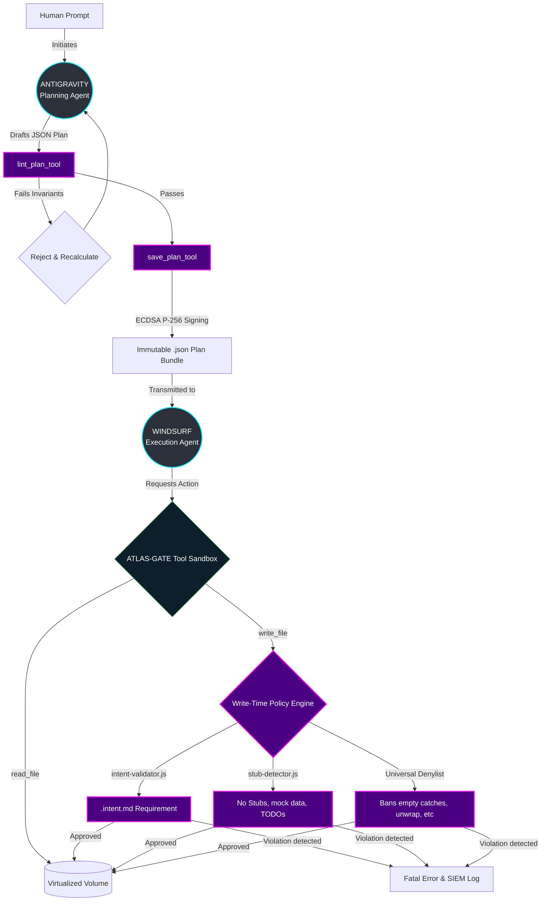

<div align="center">

# ATLAS-GATE MCP
### **A Level-5 Zero-Trust Context Provider & Agentic Safety Enclave**

[](https://www.typescriptlang.org/)
[]()
[](https://modelcontextprotocol.io)

ATLAS-GATE is a highly opinionated Model Context Protocol (MCP) server engineered to wrap AI coding assistants (like Windsurf) in a **chroot-esque virtual jail**, enforcing strict "Plans are Laws" cryptographic execution models and ensuring deterministic safety limits for autonomous codebase manipulation.

</div>

---

## 🛡️ Core Security Philosophy

AI tools are inherently non-deterministic. Running them attached to privileged development environments is a catastrophic security vulnerability waiting to happen.

**ATLAS-GATE solves this by imposing three uncompromising constraints:**
1. **"Plans are Laws":** Before *any* code is written, a declarative JSON Plan must be generated, linted against safety invariants, and cryptographically signed using Sigstore Cosign (ECDSA P-256).
2. **Chroot Boundaries:** The MCP server virtualizes the absolute paths requested by the AI. Symlink escapes, generic directory traversal, and environment snooping are trapped.
3. **Fail-Closed Execution:** Every file mutation (`write_file`) requires a `.intent.md` co-artifact. If an execution drifts from the pre-approved plan, or if stub code (`TODO`, `TBD`, mock data, empty catch blocks, or Rust panics) is detected, the process terminates immediately and logs a SIEM alert.

---

## 🏗️ Architecture Flow



---

## 🔒 Security Features

### 1. Deterministic Virtual Filesystem (VFS)
*   **Path Virtualization:** To the AI, the root repository is `/jail/mcp-session`. The server translates this back to absolute paths strictly within the authorized sandbox.
*   **Symlink Protection:** Directory traversal attacks (`../../`) and unresolved symlinks outside the root are hard-blocked.

### 2. Zero-Stub Policy Enforcement (Write-Time Engine)
*   **Objective:** Prevent AI "laziness" from reaching production.
*   **Mechanism:** Deep AST parsing on file writes traps `TODO`, `pass`, empty `catch{}` blocks, mock schemas, `unwrap/expect` in Rust, and placeholder IP addresses. Write requests failing the Write-Time Policy Engine are aborted entirely.

### 3. JIT Node.js Global Stripping
*   **Objective:** Stop the AI from executing shell commands.
*   **Mechanism:** At the V8 isolate level, dangerous globals (`eval`, `child_process`, `exec`, `setInterval`) are deleted before the MCP tools are registered.

### 4. SIEM-Ready Audit Firehose
Every prompt payload, linting failure, path translation, file write, and invariant violation is dumped to an append-only, cryptographic hash-chained `audit-log.jsonl` intended for immediate ingestion by Splunk/Datadog.

### 5. Intent Artifacts
No file mutation may occur without a companion `.intent.md` document mapping the write to the specific phase of the approved plan.

---

## 🚀 Installation & Usage

### Prerequisites
*   Node.js 20.x+
*   An MCP-compatible client (e.g., Claude Desktop, Windsurf, Cursor)
*   Cosign / Sigstore CLI (for external verification of plan signatures)

### Local Dev Setup
```bash
git clone https://github.com/dylanmarriner/ATLAS-GATE-MCP.git
cd ATLAS-GATE-MCP
npm install
npm run build
```

### Environment Configuration
The server operates securely out-of-the-box, but you can configure strict modes:
```bash
# Export the directory you want the AI to be restricted to
export ATLAS_WORKSPACE_ROOT=/home/user/my-project

# Required: Enforce cryptographic signing of plans
export ATLAS_ENFORCE_COSIGN=true 
```

### Running the Server
```bash
npm start
```

### Integrating with Windsurf
Add the following to your `windsurf_config.json`:
```json
{
  "mcpServers": {
    "atlas-gate": {
      "command": "node",
      "args": ["/path/to/ATLAS-GATE-MCP/build/index.js"],
      "env": {
        "ATLAS_WORKSPACE_ROOT": "/path/to/your/project",
        "ATLAS_ENFORCE_COSIGN": "true"
      }
    }
  }
}
```

---

## 📜 Agent Prompting Templates
To effectively utilize the "Plans are Laws" architecture, your AI agents must be prompted correctly. Refer to the `docs/templates/` directory for system prompts to seed to your Planning vs. Execution agents.

*   **`planning_prompt.md`:** Instructions for `ANTIGRAVITY` to generate structurally sound JSON plans.
*   **`plan_template.json`:** The canonical JSON schema required for plans to pass `lint_plan` and `save_plan`.
*   **`execution_template.md`:** Instructions for `WINDSURF` to strictly follow the saved plan signature ID and Write-Time Policy Engine mandates.
*   **`intent_artifact_template.md`:** The mandated schema for file mutation intents.
