# Diagram Management Guide

**How to create, edit, and regenerate diagrams in ATLAS-GATE MCP.**

## Quick Start

### View Diagrams
- Architecture: [diagrams/rendered/architecture.svg](./rendered/architecture.svg)
- Audit Flow: [diagrams/rendered/audit-flow.svg](./rendered/audit-flow.svg)
- Governance Model: [diagrams/rendered/governance-model.svg](./rendered/governance-model.svg)

### Edit Diagrams
1. Open source file in `diagrams/source/`
2. Use tool specified below (Mermaid or PlantUML)
3. Save changes
4. Run regeneration script
5. Commit both source and rendered

---

## Diagram Formats

### Mermaid (.mmd)

**Best for**: Flowcharts, sequence diagrams, architecture diagrams

**Tools**:
- VS Code extension: "Markdown Preview Mermaid Support"
- Online editor: https://mermaid.live
- CLI: `npm run docs:render`

**Example**:


**Regenerate**:
```bash
npx mmdc -i docs/diagrams/source/architecture.mmd -o docs/diagrams/rendered/architecture.svg
```

### PlantUML (.puml)

**Best for**: Entity diagrams, complex class hierarchies

**Tools**:
- VS Code extension: "PlantUML"
- Online editor: http://www.plantuml.com/plantuml/uml
- Local: `plantuml` command (requires Java)

**Example**:


**Regenerate**:
```bash
java -jar plantuml.jar docs/diagrams/source/*.puml -svg -o ../rendered/
```

---

## Diagram Directory Structure

```
docs/diagrams/
├── source/                    ← Editable source files
│   ├── architecture.mmd
│   ├── audit-flow.mmd
│   ├── governance-model.puml
│   └── README.md
│
├── rendered/                  ← Generated outputs (SVG/PNG)
│   ├── architecture.svg
│   ├── audit-flow.svg
│   └── governance-model.svg
│
└── DIAGRAM_GUIDE.md          ← This file
```

---

## Adding a New Diagram

### Step 1: Create Source File

Choose format (Mermaid or PlantUML) and create file in `docs/diagrams/source/`:

```bash
# Mermaid
docs/diagrams/source/my-diagram.mmd

# PlantUML
docs/diagrams/source/my-diagram.puml
```

### Step 2: Edit & Preview

**VS Code (recommended)**:
1. Install "Markdown Preview Mermaid Support" extension
2. Right-click `.mmd` file → "Open Preview"
3. Edit and watch live preview

**Online editor**:
- Mermaid: https://mermaid.live
- PlantUML: http://www.plantuml.com/plantuml/uml
- Edit, copy back to file

### Step 3: Regenerate Output

```bash
npm run docs:render
# or manually for specific file:
npx mmdc -i docs/diagrams/source/my-diagram.mmd -o docs/diagrams/rendered/my-diagram.svg
```

### Step 4: Add to Documentation

Link in your markdown:

```markdown


*[Source](./diagrams/source/my-diagram.mmd) | Edit on [Mermaid Live](https://mermaid.live)*
```

### Step 5: Commit Both Files

```bash
git add docs/diagrams/source/my-diagram.mmd
git add docs/diagrams/rendered/my-diagram.svg
git commit -m "docs: add my-diagram (source + rendered)"
```

---

## Regeneration Workflow

### Automatic (CI/CD)

On every commit, GitHub Actions runs:
```bash
npm run docs:build
# Includes: render + validate
```

### Manual (Before Commit)

```bash
# Regenerate all Mermaid diagrams
npm run docs:render

# Or specific tool
npx mmdc -i docs/diagrams/source/*.mmd -o docs/diagrams/rendered/

# Validate links and metadata
npm run docs:validate
```

### Batch Regeneration (All Tools)

```bash
# Mermaid
npx mmdc -i docs/diagrams/source/*.mmd -o docs/diagrams/rendered/

# PlantUML (requires Java + plantuml)
java -jar plantuml.jar docs/diagrams/source/*.puml -svg -o ../rendered/

# Then validate
npm run docs:validate
```

---

## Diagram Best Practices

### Naming
- **Mermaid**: `kebab-case.mmd`
- **PlantUML**: `kebab-case.puml`
- Example: `audit-flow.mmd`, `data-model.puml`

### Documentation
```markdown
# In the diagram source file, add a comment:

## Audit Flow Diagram
# Shows how audit entries flow through the system
# Updated: 2026-01-21
# Related: ADR-003, SECURITY_AND_GOVERNANCE.md

graph TD
    ...
```

### Styling (Mermaid)

Use consistent colors and shapes:

```mermaid
graph TD
    A["🔒 Security Component"]:::security
    B["📋 Process"]:::process
    C["💾 Data"]:::data
    
    classDef security fill:#ff6b6b
    classDef process fill:#4ecdc4
    classDef data fill:#95e1d3
```



### Complexity

Keep diagrams focused on one concept. If too complex, split into multiple diagrams:

**Bad**: One diagram showing entire system with 20+ nodes

**Good**: 
- High-level architecture (5-7 nodes)
- Detailed flow per component (separate diagram)
- Entity relationships (separate ERD)

---

## Tools Setup

### Install Mermaid CLI

```bash
npm install --save-dev @mermaid-js/mermaid-cli
```

### Install PlantUML

**Option 1: Local installation**
```bash
# macOS
brew install plantuml

# Linux (Ubuntu/Debian)
sudo apt install plantuml

# Windows (via Chocolatey)
choco install plantuml
```

**Option 2: Java-based (universal)**
```bash
# Download JAR from http://plantuml.com/download
# Place in project root or add to PATH
# Run: java -jar plantuml.jar [options]
```

### VS Code Extensions

1. **Mermaid**: "Markdown Preview Mermaid Support"
   - https://marketplace.visualstudio.com/items?itemName=bierner.markdown-mermaid

2. **PlantUML**: "PlantUML"
   - https://marketplace.visualstudio.com/items?itemName=jebbs.plantuml

---

## Editing Workflows

### Workflow 1: VS Code (Recommended)

```
1. Open source file (.mmd or .puml)
2. Right-click → "Open Preview"
3. Edit source; see live preview
4. Save file
5. Run npm run docs:render
6. Commit both source and rendered
```

### Workflow 2: Online Editor (Quick Changes)

```
1. Go to https://mermaid.live (Mermaid) or plantuml.com (PlantUML)
2. Paste source code
3. Edit with live preview
4. Copy back to source file
5. Run npm run docs:render
6. Commit
```

### Workflow 3: Draw.io (Custom Diagrams)

For highly customized diagrams:

```
1. Create diagram at https://app.diagrams.net
2. File → Export As → SVG
3. Place in docs/diagrams/rendered/
4. (Note: Source is draw.io XML file; keep copy in source/ for editing)
5. Commit both
```

---

## Troubleshooting

### Problem: Mermaid renders but output SVG is wrong

**Solution**: Update mermaid-cli
```bash
npm update @mermaid-js/mermaid-cli
```

### Problem: PlantUML requires Java but I don't have it

**Solution**: Install Java
- Download from https://www.java.com/en/download/

Or use online editor and export manually.

### Problem: Links in diagrams don't work

**Solution**: Use absolute URLs
```mermaid
# ❌ Bad (won't work):
[See docs](./docs/ARCHITECTURE.md)

# ✓ Good:
[See ADR](https://github.com/dylanmarriner/ATLAS-GATE-MCP-server/blob/main/adr/001-dual-role-governance.md)
```

### Problem: Diagram is too large/unreadable

**Solution**: 
- Reduce node count
- Split into multiple diagrams
- Use smaller font (`fontsize=10` in PlantUML)
- Increase SVG viewBox manually if needed

---

## Linking to Diagrams

### In Markdown

```markdown


*[Edit source](./diagrams/source/diagram-name.mmd) | [Mermaid Editor](https://mermaid.live)*
```

### In GitHub Issues/PRs

```markdown

```

### In README

```markdown
## Architecture


See [Architecture Document](./docs/ARCHITECTURE.md) for details.
```

---

## Version Control

### Git Configuration

Treat source and rendered together:

```bash
# .gitignore should NOT include diagrams
# Both source (.mmd, .puml) and rendered (.svg) are committed

# Check status
git status

# Stage both
git add docs/diagrams/source/my-diagram.mmd
git add docs/diagrams/rendered/my-diagram.svg

# Commit
git commit -m "docs: add my-diagram with architecture details"
```

### Diff Strategy

Source files are text and diff cleanly:

```bash
git diff docs/diagrams/source/architecture.mmd
# Shows exact text changes
```

For rendered SVG, GitHub shows binary diffs (less useful). Review source file changes instead.

---

## Maintenance

### Regenerate All Diagrams Quarterly

```bash
# Ensure all diagrams are regenerated from latest source
npm run docs:render

# Check for changes
git status docs/diagrams/rendered/

# If changes, commit
git commit -m "docs: regenerate diagrams (quarterly maintenance)"
```

### Archive Old Diagrams

When a diagram becomes obsolete:

1. Move source and rendered to `docs/diagrams/archive/`
2. Remove links from documentation
3. Commit with note: "docs: archive obsolete diagrams (superseded by ADR-NNN)"

---

## References

- **Mermaid Documentation**: https://mermaid.js.org/
- **PlantUML Documentation**: http://plantuml.com/
- **Mermaid Live Editor**: https://mermaid.live
- **PlantUML Online**: http://www.plantuml.com/plantuml/uml
- **Diagrams.net (Draw.io)**: https://app.diagrams.net

---

**Questions?** See [DOCUMENTATION_LIFECYCLE.md](../DOCUMENTATION_LIFECYCLE.md) or open an issue.
