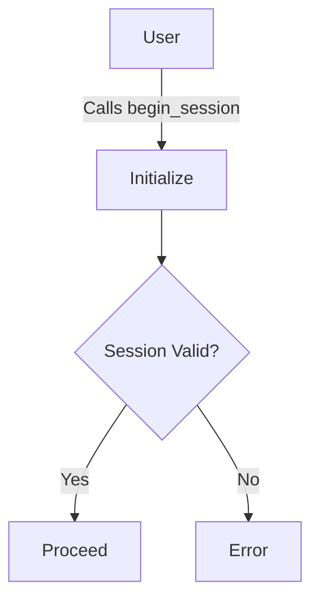
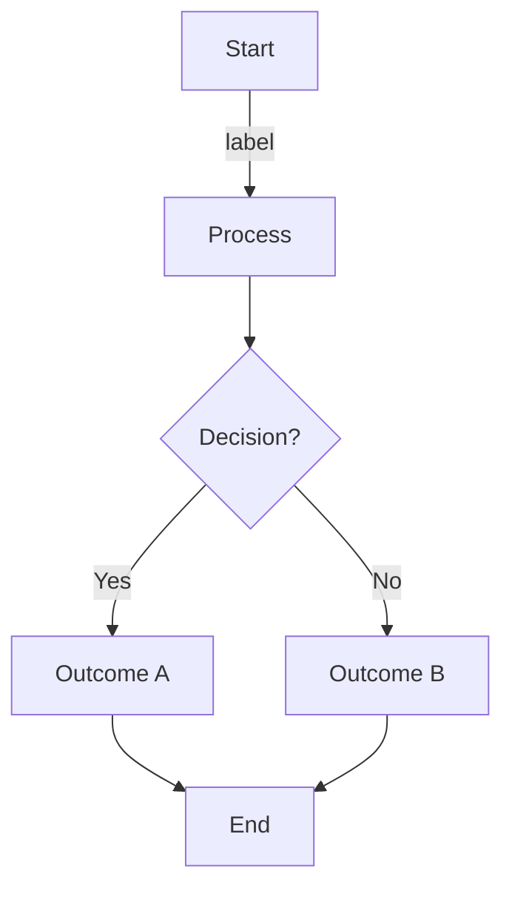
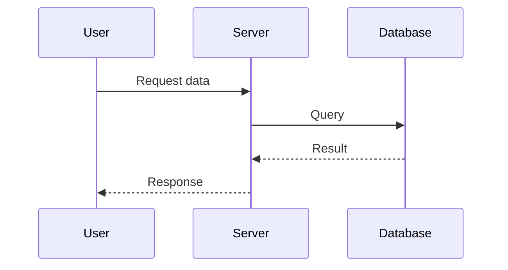
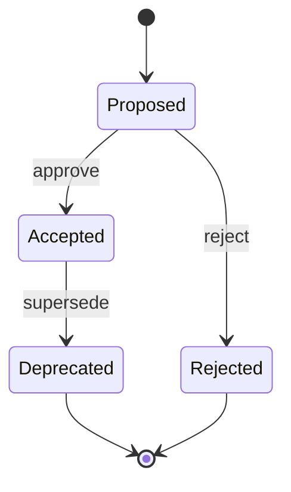
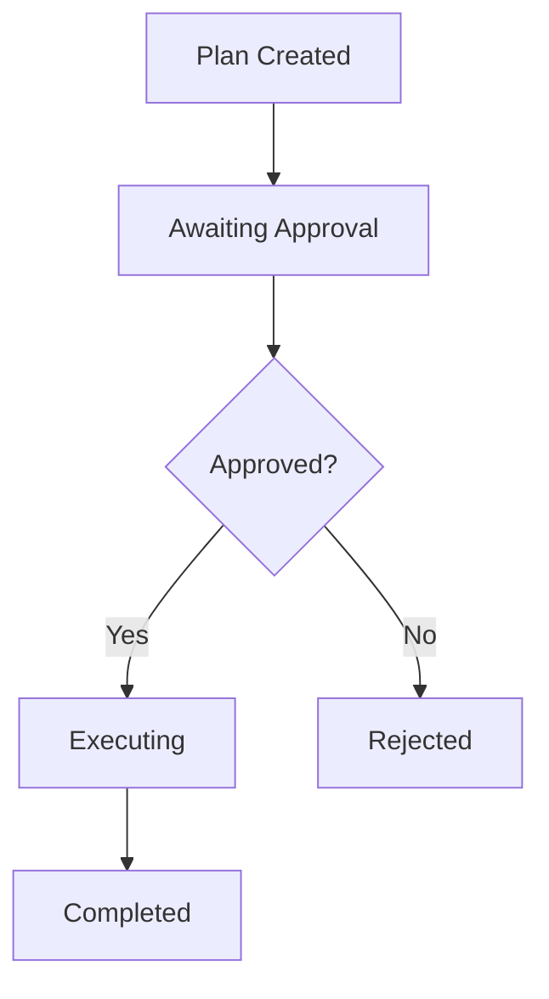
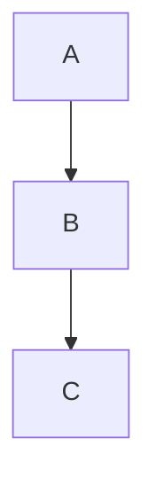
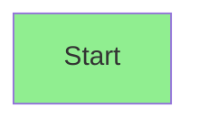

# Diagram Editing & Rendering Guide

This guide explains how to edit diagrams, regenerate SVG files, and maintain the source + rendered convention.

---

## Overview

KAIZA MCP maintains two versions of every diagram:

1. **Source** (`/docs/diagrams/source/`): Editable, human-readable format (Mermaid)
2. **Rendered** (`/docs/diagrams/rendered/`): Generated SVG output (for display)

### Directory Structure

```
docs/diagrams/
├── source/              # Editable Mermaid files
│   ├── architecture.mmd
│   ├── governance-flow.mmd
│   └── audit-trail.mmd
├── rendered/            # Generated SVG output
│   ├── architecture.mmd.svg
│   ├── governance-flow.mmd.svg
│   └── audit-trail.mmd.svg
├── EDITING_GUIDE.md     # This file
└── RENDERING_GUIDE.md   # Rendering troubleshooting
```

---

## What Is Mermaid?

**Mermaid** is a JavaScript-based diagramming and charting tool that lets you create diagrams using a simple markdown-like syntax.

### Why Mermaid?

✅ **Plain text**: Diagrams are code, editable in any text editor  
✅ **Version-controllable**: Diffs work cleanly in Git  
✅ **Renderable**: Can generate SVG/PNG automatically  
✅ **GitHub-compatible**: Renders directly in GitHub markdown  

### Diagram Types Mermaid Supports

- **Flowcharts**: Process flows, decision trees
- **Sequence Diagrams**: Actor interactions, message flows
- **Class Diagrams**: Object-oriented architecture
- **State Diagrams**: State machines, workflows
- **Entity-Relationship Diagrams**: Database schemas
- **Gantt Charts**: Timelines and schedules
- **Git Graphs**: Branching and commits
- **Pie Charts**: Distributions

---

## Quick Start: Edit a Diagram

### Step 1: Find the Source File

All editable diagrams are in `/docs/diagrams/source/`

```bash
ls docs/diagrams/source/
```

You'll see files like:
- `architecture.mmd`
- `governance-flow.mmd`
- `audit-trail.mmd`

### Step 2: Open in a Text Editor

Open the `.mmd` file in any text editor:

```bash
# VS Code
code docs/diagrams/source/architecture.mmd

# nano (command line)
nano docs/diagrams/source/architecture.mmd

# Any text editor (macOS)
open -a "Visual Studio Code" docs/diagrams/source/architecture.mmd
```

### Step 3: Edit the Diagram

Mermaid syntax is straightforward. Example flowchart:



### Step 4: Save the File

Save normally (Ctrl+S or Cmd+S)

### Step 5: Regenerate the SVG

See [Rendering](#rendering) section below.

---

## Mermaid Syntax Reference

### Flowchart (Most Common)



**Syntax:**
- `graph TD` = top-down flowchart
- `A["Text"]` = rectangular node
- `C{Text}` = diamond (decision)
- `A --> B` = arrow from A to B
- `A -->|label| B` = arrow with label

### Sequence Diagram (Interactions)



**Syntax:**
- `participant` = actor
- `->>`  = synchronous call
- `-->>`  = async/response
- `--` = dashed line

### State Diagram (State Machines)



---

## Rendering (Generate SVG)

### Automatic: npm Script

**Simplest method:**

```bash
npm run docs:render
```

This command:
1. Finds all `.mmd` files in `/docs/diagrams/source/`
2. Converts each to SVG
3. Saves to `/docs/diagrams/rendered/{filename}.svg`
4. Takes ~10–30 seconds

**What it looks like:**

```bash
$ npm run docs:render

> kaiza-mcp-server@1.0.0 docs:render
> find docs/diagrams/source -name '*.mmd' -exec npx mmdc -i {} -o docs/diagrams/rendered/{}.svg \;

✓ Rendered architecture.mmd → architecture.mmd.svg
✓ Rendered governance-flow.mmd → governance-flow.mmd.svg
✓ Rendered audit-trail.mmd → audit-trail.mmd.svg
```

### Manual: Using mmdc (Mermaid CLI)

If you want to render a specific diagram:

```bash
npx mmdc -i docs/diagrams/source/architecture.mmd -o docs/diagrams/rendered/architecture.mmd.svg
```

**Flags:**
- `-i`: Input file (the `.mmd` source)
- `-o`: Output file (the `.svg` destination)
- `-w`: Width (optional)
- `-H`: Height (optional)

**Example with size:**

```bash
npx mmdc -i docs/diagrams/source/architecture.mmd -o docs/diagrams/rendered/architecture.mmd.svg -w 1200 -H 800
```

### Online: Mermaid Live Editor

For quick previews without rendering:

1. Go to https://mermaid.live
2. Paste your Mermaid code
3. See the diagram in real-time
4. Copy the SVG when happy

---

## Workflow: Edit → Render → Commit

### Complete Example

**Step 1: Edit a diagram**

```bash
nano docs/diagrams/source/governance-flow.mmd
```

Add or modify Mermaid code:



Save the file (Ctrl+S or Cmd+S)

**Step 2: Regenerate SVG**

```bash
npm run docs:render
```

You should see output confirming the render completed.

**Step 3: Verify the SVG**

Open `/docs/diagrams/rendered/governance-flow.mmd.svg` in a browser or text editor to verify it looks correct.

**Step 4: Commit Both Files**

```bash
git add docs/diagrams/source/governance-flow.mmd
git add docs/diagrams/rendered/governance-flow.mmd.svg
git commit -m "docs: update governance-flow diagram"
git push
```

Both source and rendered files go in the commit. This ensures:
- Others can see what the diagram looks like (SVG)
- Others can edit it (source `.mmd`)
- History is complete (both versions tracked)

---

## Embedding Diagrams in Documentation

### In Markdown Files

**Embed the rendered SVG:**

```markdown
# Governance Flow


Description of what the diagram shows...
```

**Why embed SVG?**
- SVG is scalable (not blurry on high-DPI displays)
- Smaller file size than PNG
- Can be edited as text if needed
- Works in GitHub markdown

### Alternative: Inline Mermaid

Some systems support inline Mermaid (GitHub, some doc platforms):

```markdown

```

However, **we recommend** the SVG approach for:
- Guaranteed rendering consistency
- Better performance (pre-rendered)
- Explicit control over quality

---

## Mermaid Configuration

### Theme & Styling

Create a `mermaid.config.js` file:

```javascript
mermaid.initialize({
  startOnLoad: true,
  theme: 'default',
  securityLevel: 'loose',
  flowchart: {
    htmlLabels: true,
  },
});
```

For CLI rendering, add to your npm script:

```bash
mmdc -i input.mmd -o output.svg --configFile mermaid.config.js
```

### Common Issues & Fixes

**Issue: Text doesn't fit in nodes**
- Solution: Use shorter labels or multi-line syntax

```mermaid
A["Long text<br/>on multiple<br/>lines"]
```

**Issue: Diagram is too wide or tall**
- Solution: Adjust with `-w` and `-H` flags

```bash
npx mmdc -i input.mmd -o output.svg -w 1600 -H 900
```

**Issue: Colors don't render**
- Solution: Use Mermaid's color syntax



---

## Validation & CI Integration

### Validate Diagram Sources

Check that all diagrams render without errors:

```bash
npm run docs:validate
```

This script checks:
- ✅ All `.mmd` files are valid syntax
- ✅ All rendered SVGs exist and match source
- ✅ No broken references
- ✅ File naming conventions followed

### CI/CD Pipeline

The GitHub Actions workflow automatically:

1. Runs on every commit to `docs/diagrams/source/*.mmd`
2. Re-renders all affected SVG files
3. Fails if rendering encounters errors
4. Comments on PR if diagrams changed

---

## Diagram Inventory

Current diagrams in the repository:

| Name | Type | Purpose |
|------|------|---------|
| `architecture.mmd` | Flowchart | System architecture overview |
| `governance-flow.mmd` | Flowchart | Plan approval and execution flow |
| `audit-trail.mmd` | Sequence | Audit logging sequence |
| `role-definitions.mmd` | State | Role states and transitions |
| `dual-role-model.mmd` | Flowchart | Antigravity vs. Windsurf roles |

---

## Adding New Diagrams

### Process

1. **Create source file:**
   ```bash
   touch docs/diagrams/source/my-diagram.mmd
   ```

2. **Add Mermaid content:**
   ```bash
   echo 'graph TD
       A --> B
       B --> C' > docs/diagrams/source/my-diagram.mmd
   ```

3. **Render:**
   ```bash
   npm run docs:render
   ```

4. **Verify SVG created:**
   ```bash
   ls docs/diagrams/rendered/my-diagram.mmd.svg
   ```

5. **Embed in docs:**
   ```markdown
   
   ```

6. **Commit both files:**
   ```bash
   git add docs/diagrams/source/my-diagram.mmd
   git add docs/diagrams/rendered/my-diagram.mmd.svg
   git commit -m "docs: add my-diagram"
   ```

---

## Best Practices

### ✅ DO

- Keep diagram files in `/docs/diagrams/source/`
- Generate SVG with `npm run docs:render`
- Commit both source and rendered files
- Use meaningful names (`governance-flow.mmd`, not `diagram1.mmd`)
- Keep diagrams focused (one concept per diagram)
- Update diagrams when architecture changes

### ❌ DON'T

- Manually edit `.svg` files (they're generated)
- Use different folder structures
- Forget to commit the rendered SVG
- Create huge, complicated diagrams (split into smaller ones)
- Use proprietary formats (stick to Mermaid)

---

## Troubleshooting

### Problem: `mmdc: command not found`

**Cause:** Mermaid CLI not installed

**Fix:**
```bash
npm install --global @mermaid-js/mermaid-cli
# or locally
npm install @mermaid-js/mermaid-cli --save-dev
```

### Problem: SVG file is blank

**Cause:** Mermaid syntax error in `.mmd` file

**Fix:**
1. Check syntax in Mermaid Live Editor (https://mermaid.live)
2. Fix the error in the `.mmd` file
3. Re-render: `npm run docs:render`

### Problem: Fonts look wrong in SVG

**Cause:** Font not embedded or available

**Fix:**
- Mermaid uses system fonts
- SVGs should render in any browser
- If embedding in PDF, may need to specify fonts

### Problem: npm run docs:render is slow

**Cause:** Too many diagrams or network latency

**Fix:**
- Check internet connection
- Render specific file instead: `npx mmdc -i docs/diagrams/source/architecture.mmd -o docs/diagrams/rendered/architecture.mmd.svg`
- Be patient (first run may take 30s)

---

## References

- **Mermaid Documentation:** https://mermaid.js.org/
- **Mermaid Live Editor:** https://mermaid.live/
- **GitHub Mermaid Support:** https://github.blog/2022-02-14-include-diagrams-in-your-markdown-files-with-mermaid/

---

**Document Owner:** KAIZA MCP Documentation Team  
**Last Updated:** 2026-01-20  
**Version:** 1.0.0
